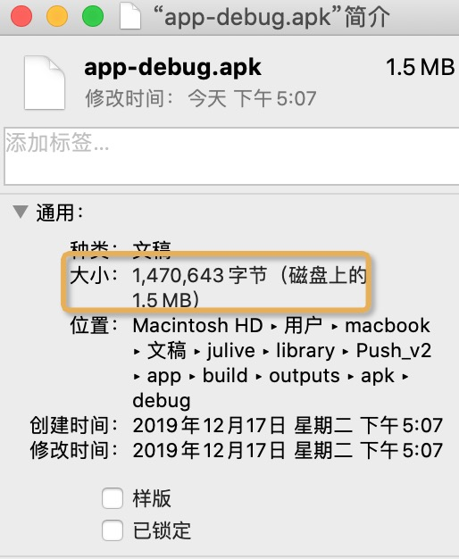

# Push_v2

## push v1 到 Push v2 集成方式及架构演进

Push v1 README: https://github.com/13120241790/Push 

### 一 Push v1 现存弊端: 


- 由于当时 Push v1 设计是做全平台接入设计，打包了全平台例如极光、小米、华为的 Push SDK 目前实测会对 apk 新增增量 1.1 MB ~ 1.3 MB ，这个值会随着其他平台的接入而递增，例如后续再添加 OPPO，vivo 这样增量也会递增。
- 对于只需要用某1 到 2 个平台的使用者，全量的接入是一种耗费，例如我现阶段只需要接入华为推送，Push 库把其他小米、OPPO、vivo 这些不需要的强加上去，也是不太优雅的。


总而言之:  我需要解决 Push 库按需取用的问题，怎么才能解决这个问题呢？


我们来看下 Push 库的源码，以小米平台为例。应用启动判断设备是小米，然后走到 MiPush 的小米初始化，这个时候是必须要依赖小米 SDK 的接口，类似于 华为 和 极光在 Push 库都有对应的接口依赖。

查阅了很多资料和思考初步有两个方案能够解决按需拉取的问题:


### 二 Plan A & Plan B

一 ：Jenkins + 脚本构建方式:


通过 Jenkins 提供可视化的 Push SDK 构建。例如: 现在我的项目只需要华为推送，在 Jenkins 的可视化工具上勾选华为这个时候生成的 SDK 就是只包含华为推送相关代码。这个方法有两个弊端: 

1. 项目发现小米的设备安装量在上升 决定接入小米 Push。这个时候原本 Push SDK 就不够适用了，需要重新去 Jenkins 构建平台上重新勾选包含华为+小米的 Push SDK 
2. Jenkins 的可视化 Push SDK 构建成本，背后必然是有一套 Python&Shell 脚本去维护和操作对 Push SDK Java 代码的打包，一个是这个工作量大另外一个还要求对脚本语言 Python&Shell  + Groovy 有一定涉猎


这种方式作为保底方案，如果没有更优解的话就采取这套方案了


二：欺骗编译 + 反射


什么叫欺骗编译，实际上就是绕开编译期 Java 虚拟机对引用关系的检查。以小米为例:


假设我们把小米的 SDK jar 移动到应用层，Push 库中立马报错。编译都编译不过谈何继续下去。


将实际的 Push 库的代码打成 jar 包，实际上只有 75 kb


通过将源代码打成 class 文件 jar 包的方式。给应用层提供依赖，成功的跳过了编译期的检查将问题抛到了运行时

但是运行时的问题也得解决，不然这个应用只集成了华为，但是应用运行在小米手机上，Push 库会自动判断然后去尝试做小米 Push 的初始化和注册。

逃过了编译期的检查还是没能避免在运行时问题爆发出来，见上图，在启动的时候抛出了一个错误

```java
java.lang.NoClassDefFoundError: Failed resolution of: Lcom/xiaomi/mipush/sdk/MiPushClient;
```

找不到小米的依赖接口，当然了因为我没有添加小米的依赖库。有人说在应用层把小米的 Push SDK 加上就不会报错了。对是这样，但是其他平台呢？华为 vivo OPPO 我也得加吗不然担心还会报错，这样又变成了全平台接入了，问题又回到了原点。


总会有解决办法，这个时候反射上场了


目前我在极光平台上做的实验:


见上方图，图1将极光秘钥的 Push 配置全部注释，Maven 的远程依赖也注释。Run 结果是在匹配极光的设备上运行没有崩溃报错，日志输出 Current platform SDK not found!  可见 Push 库是能够检查到对应平台以及对应平台的 SDK 到底有没有做接入，图2将极光的 maven 依赖放开注释 Run 结果是成功运行没有报错，并且极光 SDK 反馈注册成功。


```Java
else {
//设备已经判断进入极光平台

            String clsName = "cn.jpush.android.api.JPushInterface";
            Class<?> jpushCls = null;
            try {
                jpushCls = Class.forName(clsName);
            } catch (ClassNotFoundException e) {
                e.printStackTrace();
            }
            if (jpushCls != null) {
                push = new JPush();
            }
        }
        if (push == null) {
            Log.e(PUSH_TAG, "Current platform SDK not found!");
            return;
        }
        push.register(context, config);
    }
```


上图就是利用反射机制检查项目有没有接入对应设备平台的代码。也就是这样利用编译欺骗+反射的方式，目前来说成功的解决了 Push 库按需取用的问题，实现成本也很低，对性能也没有影响。


### 三 增量核算





​									

​									见上图依赖 Push 库前产生的 debug apk 1470 字节

​									依赖 Push 后产生的 debug apk 1493 字节

​									结果表明纯 Push 库对 apk 的实际增量约为 23kb 